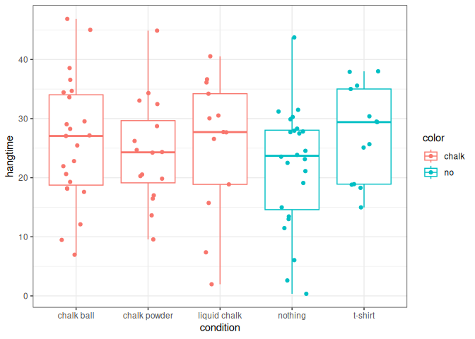

Effect of Chalk on Hangtime
================
20 January, 2026

This manuscript uses the Workflow for Open Reproducible Code in Science
(Van Lissa et al. 2021) to ensure reproducibility and transparency. All
code <!--and data--> are available at <demo_worcs2>.

This is an example of a non-essential citation (@ Van Lissa et al.
2021). If you change the rendering function to `worcs::cite_essential`,
it will be removed.

<!--The function below inserts a notification if the manuscript is knit using synthetic data. Make sure to insert it after load_data().-->

## Results

|                        | Estimate | Std. Error | t value | Pr(\>\|t\|) |
|:-----------------------|---------:|-----------:|--------:|------------:|
| (Intercept)            |    25.15 |       1.10 |   22.94 |        0.00 |
| conditionnoVchalk      |     0.44 |       1.34 |    0.33 |        0.74 |
| conditionliquidVsolid  |    -0.25 |       2.14 |   -0.12 |        0.91 |
| conditionpowderVball   |     0.92 |       1.62 |    0.57 |        0.57 |
| conditionnothingVshirt |     2.80 |       1.72 |    1.63 |        0.11 |

Regression coefficients for planned contrasts for the effect of chalk on
hangtime.

We find that using chalk has a non-significant effect on hang time,
$t = 0.33, p = 0.74$.

<!-- -->

Van Lissa, Caspar J., Andreas M. Brandmaier, Loek Brinkman, Anna-Lena
Lamprecht, Aaron Peikert, Marijn E. Struiksma, and Barbara M. I. Vreede.
2021. “WORCS: A Workflow for Open Reproducible Code in Science.” *Data
Science* 4 (1): 29–49. <https://doi.org/10.3233/DS-210031>.

